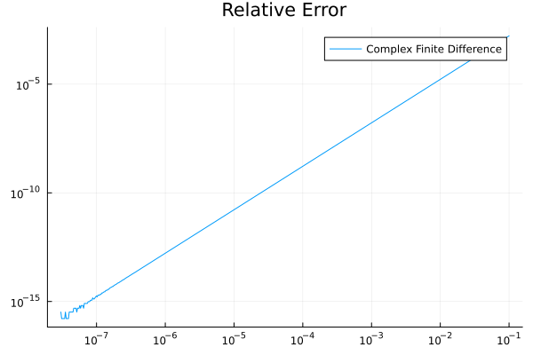

# ComplexDiff.jl

## I can't believe it's not real

Say you like finite differences, but dislike how they succumb to catastrophic cancellation. Define

$$
f^\prime(x_0) \equiv \lim_{h\to 0} \textrm{Im}\left(\frac{f(x_0+i h)}{h}\right),
$$
with $i^2 = -1$ and $\textrm{Im}(z)$ the imaginary part of $z$.

If you plot it, you get something like

whereas the complex difference scheme as described in [Squire and Trapp](https://epubs.siam.org/doi/epdf/10.1137/S003614459631241X) or [Nick Higham's blog](https://nhigham.com/2020/10/06/what-is-the-complex-step-approximation/) will give you

where the lack of subtraction will let you have accurate approximations even when $x_0 = 10^-100$.

WIP: This package implements that approach, and bridges your Julian experience via `DifferentiationInterface.jl` and `ADTypes.jl`.

## How to Cite

If you use ComplexDiff.jl in your work, please cite using the reference given in [CITATION.cff](https://github.com/miguelraz/ComplexDiff.jl/blob/main/CITATION.cff).

## Contributing

If you want to make contributions of any kind, please first that a look into our [contributing guide directly on GitHub](docs/src/90-contributing.md) or the [contributing page on the website](https://miguelraz.github.io/ComplexDiff.jl/dev/90-contributing/)

---

### Contributors

<!-- ALL-CONTRIBUTORS-LIST:START - Do not remove or modify this section -->
<!-- prettier-ignore-start -->
<!-- markdownlint-disable -->

<!-- markdownlint-restore -->
<!-- prettier-ignore-end -->

<!-- ALL-CONTRIBUTORS-LIST:END -->
